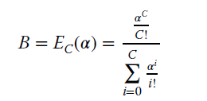
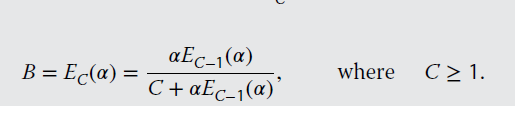
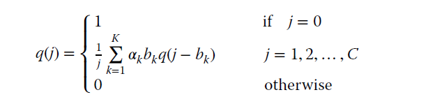

# Teletraffic Loss Models
This repository contains implementations of mathematical formulas related to teletraffic loss models, as described in the book <a href="https://www.amazon.co.uk/Efficient-Multirate-Teletraffic-Models-Beyond/dp/111942688X" target="_blank"> Efficient Multirate Teletraffic Loss Models.</a>

These models are commonly used in the field of telecommunications and beyond to analyse and optimise performance, particularly in scenarios involving multirate traffic and varying levels of service demand.

## For the Basic Erlang-B formula which is restricted to systems with C ≤ 170 b.u.
please cd to `erlang-formulas`

## For the Recursive Erlang-B formula.
please cd to `erlang-formulas`

## For the recursive Kaufman-Roberts formula
please cd to `kaufman-roberts-formulas`

