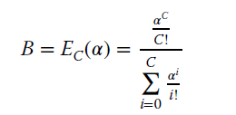
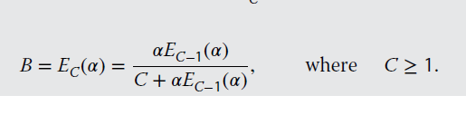

# Erlang-B formulas

## Description
This project includes implementations of both the basic and recursive versions of the Erlang-B formula.

Basic Erlang-B formula. This is restricted to systems with C ≤ 170 b.u.

Recursive Erlang-B formula.

## Installation
1. Clone the repository: `git clone https://https://github.com/mariakourtesi/Teletraffic-models.git`
2. Navigate to the project directory: `cd erlang-formulas`
3. Install the required dependencies: `npm ci`

Please note: you need Node v20

## Running the formulas
To run this project, type npm run erlang. When prompted, type `B` for the Basic Erlang-B formula or `R` for the Recurrent Erlang-B formula.

## Erlang-B formula
 The Erlang B formula calculates the blocking probability of a buffer-less loss system, where a request that is not served immediately is aborted, causing that no requests become queued. Blocking occurs when a new request arrives at a time where all available servers are currently busy. The formula also assumes that blocked traffic is cleared and does not return.
