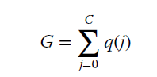
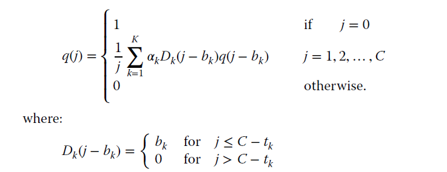

# Kaufman-Roberts

## Description
This project implements various mathematical models related to network optimization and performance analysis, specifically focusing on the Kaufman-Roberts, Roberts, and Dziong-Roberts formulas under complete sharing and bandwidth reservation policies.

These formulas are widely used in telecommunications and network engineering to address challenges such as traffic management, resource allocation, and network dimensioning.

### Kaufman-Roberts recursive unnormalised formula.


### Kaufman-Roberts recursive normalised formula.



## Roberts formula or Erlang Multirate Loss Model under the Bandwidth Reservation policy



## Installation
1. Clone the repository: `git clone https://https://github.com/mariakourtesi/Teletraffic-models.git`
2. Navigate to the project directory: `cd kaufman-roberts-formulas`
3. Install the required dependencies: `npm ci`

Please note: you need Node v20

## Running the formulas
1. Build the app: `npm run build`
2. Install it locally: `npm install -g .`
3. Run the command: `emlm kaufman-roberts -c 5 -s`

You can run the command in either of the following ways:

**In Bash**:
You can create a json file and add the array of service classes there.
```emlm kaufman-roberts --capacity 5 --serviceClasses "$(cat src/serviceClasses.json)"```

Or, by directly providing the JSON string:
```emlm kaufman-roberts --capacity 5 --serviceClasses '[{"serviceClass": 1, "bu": 1, "incomingLoad_a": 2}, {"serviceClass": 2, "bu": 2, "incomingLoad_a": 1}]'```

**In Command Prompt** (for windows users):
```emlm kaufman-roberts --capacity 5 --serviceClasses '[{"serviceClass": 1, "bu": 1, "incomingLoad_a": 2}, {"serviceClass": 2, "bu": 2, "incomingLoad_a": 1}]'```

## Kaufman-Roberts formula
The Kaufman-Roberts formula is a multi-dimensional Erlang method that calculates the blocking probability when multiple services share a common resource pool. It's used to evaluate the blocking probability in a multirate system with circuit traffic.

 <a href="[https://readme.com/](https://www.ibm.com/docs/en/tnpm/1.4.4?topic=functions-kaufman-roberts-based)" target="_blank">Kaufman-Roberts based functions<a>

## Validation Instructions
To verify that this implementation works, follow these steps:
Navigate to Teletraffic Models https://teletraffic-models.appspot.com/ 


Select the `Kaufman - Roberts Formula option`.

- Set the following parameters:
  - Link Capacity (C): 4
  - Number of Service Classes: 2

Configure the service classes:

- Service Class 1:
   - Traffic Load (a): 2
   - Bandwidth Demand: 1
- Service Class 2:
   - Traffic Load (a): 1
   - Bandwidth Demand: 2

The expected output is:

The output is:
| J    | q(j)    | Q(j) Normalised values |
| ---- | ------- | ---------------------  |
|   0  |    1    |       0.08             |
|   1  |    2    |       0.16             |
|   2  |    3    |       0.24             |
|   3  | 3.3333  |       0.26667          |
|   4  | 3.1667  |       0.25333          |


## Roberts formula or Erlang Multirate Loss Model under the BR policy

"By properly selecting the BR parameters tk, we can achieve CBP equalization among service-classes; this is the main target of the
BR policy" extracted from the book  
<a href="https://www.wiley.com/en-us/Efficient+Multirate+Teletraffic+Loss+Models+Beyond+Erlang-p-9781119426882" target="_blank">Efficient Multirate Teletraffic Loss Models Beyond Erlang</a>


