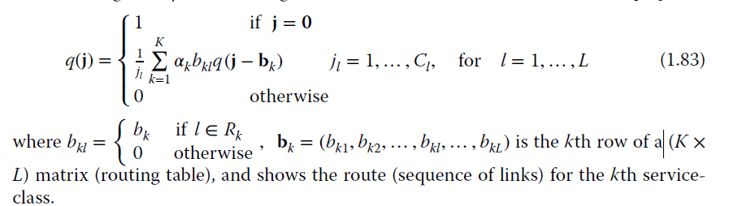

# Erlang Multirate Loss Models

## Description
This project implements various mathematical models related to network optimization and performance analysis, 
it also implements the proposed analytic model, which calculates blocking probabilities in a cloud system offering IaaS, as described in the paper  <a href="https://ieeexplore.ieee.org/document/9483923" target="_blank">A Multiparameter Analytical Model of the Physical Infrastructure of a Cloud-Based System<a>

These formulas are widely used in telecommunications and network engineering to address challenges such as traffic management, resource allocation, and network dimensioning.

#### For the Kaufman-Roberts models 
`cd formulas/kaufman-roberts`

### Kaufman-Roberts recursive unnormalised formula.

### Kaufman-Roberts recursive normalised formula.

## Roberts formula or Erlang Multirate Loss Model under the Bandwidth Reservation policy

## Dziong-Roberts recursive formula

The Dziong-Roberts formula is used for calculating state probabilities in a fixed-routing network with multiple service classes, each with different bandwidth requirements, and it can be applied across multiple links.

Although this formula calculates the Call Blocking Probability in an accurate way, it has a high computational complexity.

## Reduced Load Approximation formula or knapsack approximation
This formula considers that the offered traffic-load of a service-class to a link is actually reduced when traversing through a sequence of links.

The approximate CBP calculation of service-class k, Bk, in the entire
route Rk, is given by:

## Kaufman-Roberts formula
The Kaufman-Roberts formula is a multi-dimensional Erlang method that calculates the blocking probability when multiple services share a common resource pool. It's used to evaluate the blocking probability in a multirate system with circuit traffic.

 <a href="https://www.ibm.com/docs/en/tnpm/1.4.4?topic=functions-kaufman-roberts-based" target="_blank">Kaufman-Roberts based functions<a>

## Roberts formula or Erlang Multirate Loss Model under the BR policy

"By properly selecting the BR parameters tk, we can achieve CBP equalization among service-classes; this is the main target of the
BR policy" extracted from the book  
<a href="https://www.wiley.com/en-us/Efficient+Multirate+Teletraffic+Loss+Models+Beyond+Erlang-p-9781119426882" target="_blank">Efficient Multirate Teletraffic Loss Models Beyond Erlang</a>

