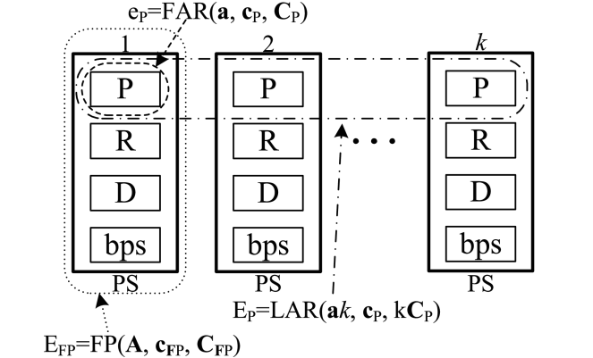

### A Multiparameter Analytical Model of the Physical Infrastructure of a Cloud-Based System

This section implements the proposed analytic model, which calculates blocking probabilities in a cloud system offering IaaS, as described in the paper  <a href="https://ieeexplore.ieee.org/document/9483923" target="_blank">A Multiparameter Analytical Model of the Physical Infrastructure of a Cloud-Based System<a>.

It combines mathematical models such as:

 # Full-Availability resources (FAR) model 
 which is an implementation of the [Kaufman-Roberts](../kaufman-roberts/kaufman-roberts-formula.ts) formula.

# Limited Available Resources (LAR) model 
 it's implementation can be found in the [limited available resources](../limited-available-resources-model/limited-available-resources-model.ts) directory.

# Fixed Point method or Reduced Load Approximation (LAR)
 it's implementation can be found in the [reduced-load-approximation](../reduced-load-approximation/reduced-load-approximation.ts) directory.

"Activation of a new Virtual Machine (VM) on a Physical Machine (PM) can be effected only if this PM has enough free resources defined by a call VMi . A decomposition of PMs into four independent system components is carried out in the model: processors (P), RAM (R), the hard disk (D), and bitrate (bps)"

The way each of the above formulas are implemented can be seen in the picture below:
