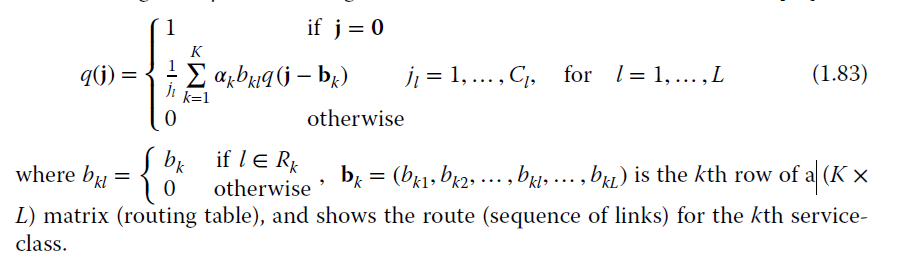

## Dziong-Roberts recursive formula

The Dziong-Roberts formula is used for calculating state probabilities in a fixed-routing network with multiple service classes, each with different bandwidth requirements, and it can be applied across multiple links.

Although this formula calculates the Call Blocking Probability in an accurate way, it has a high computational complexity.