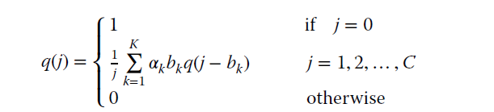

## Kaufman-Roberts formula
The Kaufman-Roberts formula is a multi-dimensional Erlang method that calculates the blocking probability when multiple services share a common resource pool. It's used to evaluate the blocking probability in a multirate system with circuit traffic.

 <a href="https://www.ibm.com/docs/en/tnpm/1.4.4?topic=functions-kaufman-roberts-based" target="_blank">Kaufman-Roberts based functions<a>

### Kaufman-Roberts recursive unnormalised formula.

### Kaufman-Roberts recursive normalised formula.

## Roberts formula or Erlang Multirate Loss Model under the Bandwidth Reservation policy

## Roberts formula or Erlang Multirate Loss Model under the BR policy

"By properly selecting the BR parameters tk, we can achieve CBP equalization among service-classes; this is the main target of the BR policy" 
extracted from the book <a href="https://www.wiley.com/en-us/Efficient+Multirate+Teletraffic+Loss+Models+Beyond+Erlang-p-9781119426882" target="_blank">Efficient Multirate Teletraffic Loss Models Beyond Erlang</a>
