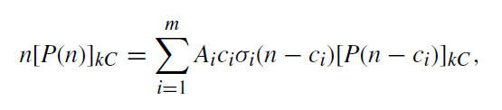
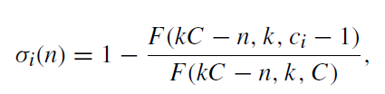
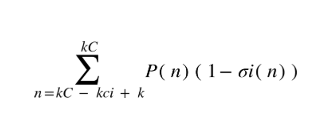

# Limited Available Resources (LAR) Model

## Description

LAR is a model of resources that are composed of k identical
separate resources. A call of class i that requires ci AUs can
be admitted for service only when it can be entirely serviced
by one of the separate resources. This means that all ci units
must be serviced only by one, from k, separate resources,
so there is no possibility of dividing ci units between a number
of separate resources.

Source: <a href="https://ieeexplore.ieee.org/document/9483923" target="_blank">A Multiparameter Analytical Model of the Physical Infrastructure of a Cloud-Based System<a>

### Occupancy distribution in LAR.

### Conditional Transition

Conditional transition probability
for transitions between neighboring occupancy states
in LAR

where F(x,k,c) is the number of possible distributions
of x free (unoccupied) AUs in k separate resources,
where each of the resources has a capacity of C units.

## Blocking propability in LAR

