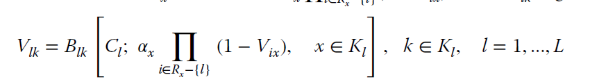

## Reduced Load Approximation formula or knapsack approximation
This formula considers that the offered traffic-load of a service-class to a link is actually reduced when traversing through a sequence of links.

The approximate CBP calculation of service-class k, Bk, in the entire
route Rk, is given by:

